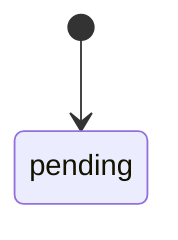
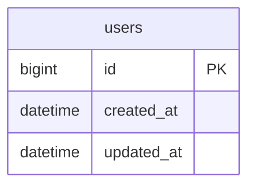

# Database Design Template

Use this for `database.md`.
Before using this template, read [database-modeling-workflow.md](database-modeling-workflow.md). Database design must be evidence-driven: every table, field, index, enum, nullable decision, redundant field, lock field, and idempotency field needs a source basis. Mark unsupported items as `仍未闭环`; do not invent them.

````markdown
# 证据驱动数据表结构设计

## 1. 建模输入材料清单

| 材料 | 来源 | 证据状态 | 说明 |
| --- | --- | --- | --- |
| PRD / 需求描述 |  |  |  |
| 业务流程 / 状态机 |  |  |  |
| 页面 / 表单 / 列表 / 详情 |  |  |  |
| 接口 / DTO |  |  |  |
| 现有表 / model / migration（二开） |  |  |  |
| 查询 / 统计 / 报表场景 |  |  |  |

## 2. 项目类型与建模结论

- 项目类型：0-1 项目 / 二开项目 / 待确认
- 本次是否新增表：
- 本次是否新增字段：
- 本次是否调整已有字段或索引：
- 仍未闭环事项：

## 3. 业务事实、对象、动作与状态机

### 3.1 必须持久化的业务事实

| 业务事实 | 来源依据 | 对应表/字段 | 证据状态 |
| --- | --- | --- | --- |

### 3.2 业务对象与生命周期

| 业务对象 | 生命周期 | 是否独立成表 | 判断依据 | 证据状态 |
| --- | --- | --- | --- | --- |

### 3.3 状态机与业务动作



| 状态/动作 | 触发角色 | 触发条件 | 数据影响 | 证据状态 |
| --- | --- | --- | --- | --- |

## 4. 数据模型总览



## 5. 表结构详细说明

### [业务实体]（table_name）

业务说明：
新增/复用/扩展依据：
二开兼容性说明：

| 字段名 | 类型 | 主键/索引 | 是否可为空 | 默认值 | 是否冗余 | 来源依据 | 说明 | 证据状态 |
| --- | --- | --- | --- | --- | --- | --- | --- | --- |
| id | bigint unsigned | PK | 否 | - | 否 | 项目主键策略 | 主键 | 文档已确认 |
| created_at | datetime | IDX | 否 | CURRENT_TIMESTAMP | 否 | 审计/创建时间 | 创建时间 | 文档已确认 |
| updated_at | datetime | - | 否 | CURRENT_TIMESTAMP | 否 | 审计/更新时间 | 更新时间 | 文档已确认 |
| deleted_at | datetime | IDX | 是 | NULL | 否 | 软删除策略 | 软删除时间 | 文档已确认 |

索引设计：

| 索引名 | 字段 | 类型 | 来源查询/约束场景 | 说明 | 证据状态 |
| --- | --- | --- | --- | --- | --- |
| idx_xxx |  | 普通/唯一 |  |  |  |

关联关系：

- `xxx_id` -> `xxx.id`

## 6. 字段决策矩阵

| 决策项 | 结论 | 判断依据 | 证据状态 |
| --- | --- | --- | --- |
| 字段是否存在 |  | 业务事实/业务动作/状态/查询/审计/兼容/统计需求 |  |
| 字段类型 |  | 业务含义、范围、精度、计算方式 |  |
| NULL / NOT NULL |  | 必填性、历史数据、二开兼容性 |  |
| 冗余字段 |  | 快照、性能、跨模块解耦、报表、审计 |  |
| 乐观锁字段 |  | 并发更新同一业务对象且不能覆盖 |  |
| 幂等字段 |  | 重复提交、第三方回调、支付、退款 |  |

## 7. 二开兼容性与变更策略

| 变更对象 | 变更类型 | 为什么不能复用旧结构 | 影响范围 | 迁移/双写/回滚方案 | 是否已人工确认 | 证据状态 |
| --- | --- | --- | --- | --- | --- | --- |

## 8. 设计说明

### 主键策略
### 软删除策略
### 枚举字段说明
### NULL / NOT NULL 策略
### 冗余字段策略
### 索引策略
### 事务、幂等与锁策略
### 数据量与分表策略
### 数据归档策略
### 人工待确认项
````

Checks:

- Every core entity from PRD appears in the ER diagram or is explicitly excluded.
- Each table has business purpose, primary key, timestamps, and index rationale.
- Enum values are explained.
- Large data tables include partitioning or a "暂不需要" rationale.
- Every table, field, index, enum, nullable decision, redundant field, lock field, and idempotency field has a source basis and evidence state.
- In 0-1 projects, page fields and DTO fields are used as reverse checks, not as the first modeling basis.
- In secondary development, existing table semantics and compatibility risks are documented before new tables or fields are proposed.
- Existing database changes, including length expansion, comments, defaults, indexes, and nullable changes, require explicit human confirmation before DDL or code changes.

