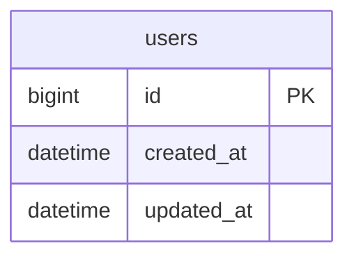

# Database Design Template

Use this for `database.md`.

````markdown
# 数据表结构设计

## 1. 数据模型总览



## 2. 表结构详细说明

### [业务实体]（table_name）

业务说明：

| 字段名 | 类型 | 主键/索引 | 必填 | 默认值 | 说明 |
| --- | --- | --- | --- | --- | --- |
| id | bigint unsigned | PK | 是 | - | 主键 |
| created_at | datetime | IDX | 是 | CURRENT_TIMESTAMP | 创建时间 |
| updated_at | datetime | - | 是 | CURRENT_TIMESTAMP | 更新时间 |
| deleted_at | datetime | IDX | 否 | NULL | 软删除时间 |

索引设计：

- `idx_xxx`: 用于...

关联关系：

- `xxx_id` -> `xxx.id`

## 3. 设计说明

### 主键策略
### 软删除策略
### 枚举字段说明
### 数据量与分表策略
### 数据归档策略
````

Checks:

- Every core entity from PRD appears in the ER diagram or is explicitly excluded.
- Each table has business purpose, primary key, timestamps, and index rationale.
- Enum values are explained.
- Large data tables include partitioning or a "暂不需要" rationale.

