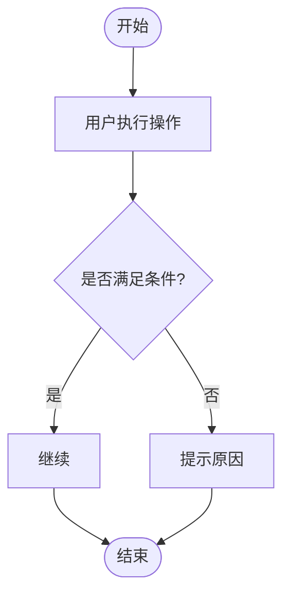
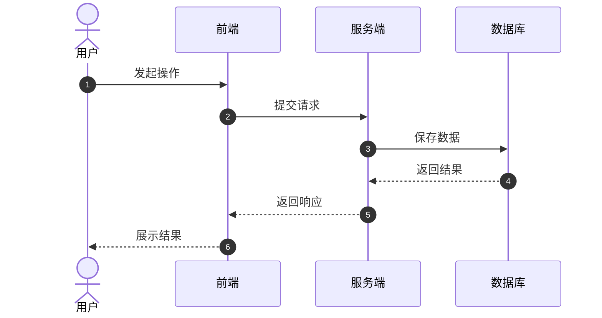
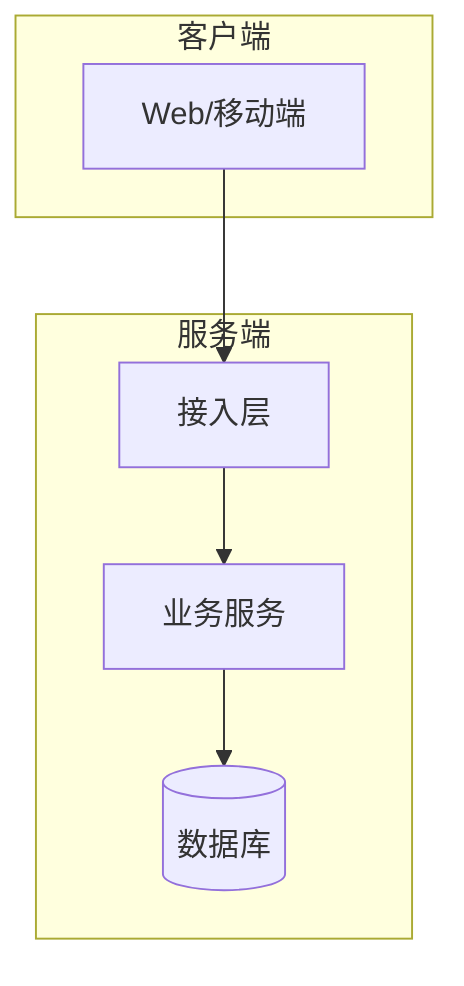

# Diagrams Template

All diagrams must be Mermaid code blocks.

## Required Diagrams

Use these when relevant:

- Mindmap: product function overview.
- Flowchart: user operation or business process.
- Sequence diagram: component or service interaction.
- Architecture diagram: system layers and dependencies.
- State diagram: orders, approvals, tickets, workflows.
- ER diagram: database entities, placed in `database.md` when possible.

## File Structure

````markdown
# [需求名称] 图表文档

## 图1：功能全貌思维导图

一句话说明。


## 图2：核心业务流程图



## 图3：核心时序图



## 图4：技术架构图


````

## Diagram Checks

- Each flowchart has start and end nodes.
- Decision nodes have at least two exits.
- Sequence diagrams use `autonumber`.
- Architecture diagrams group client, server, data, and external dependencies when applicable.
- Diagram names match terminology used in PRD and technical plan.

